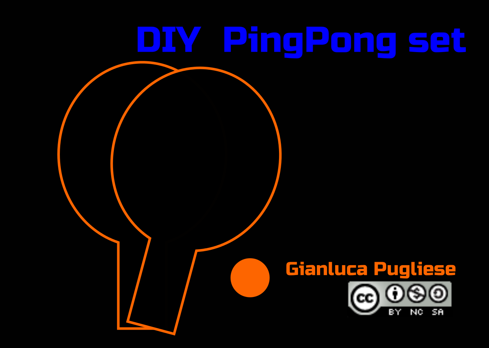
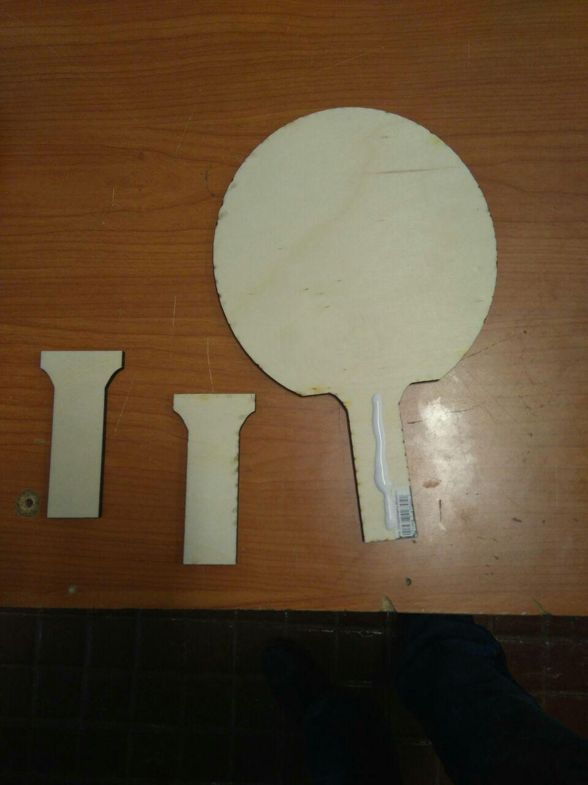
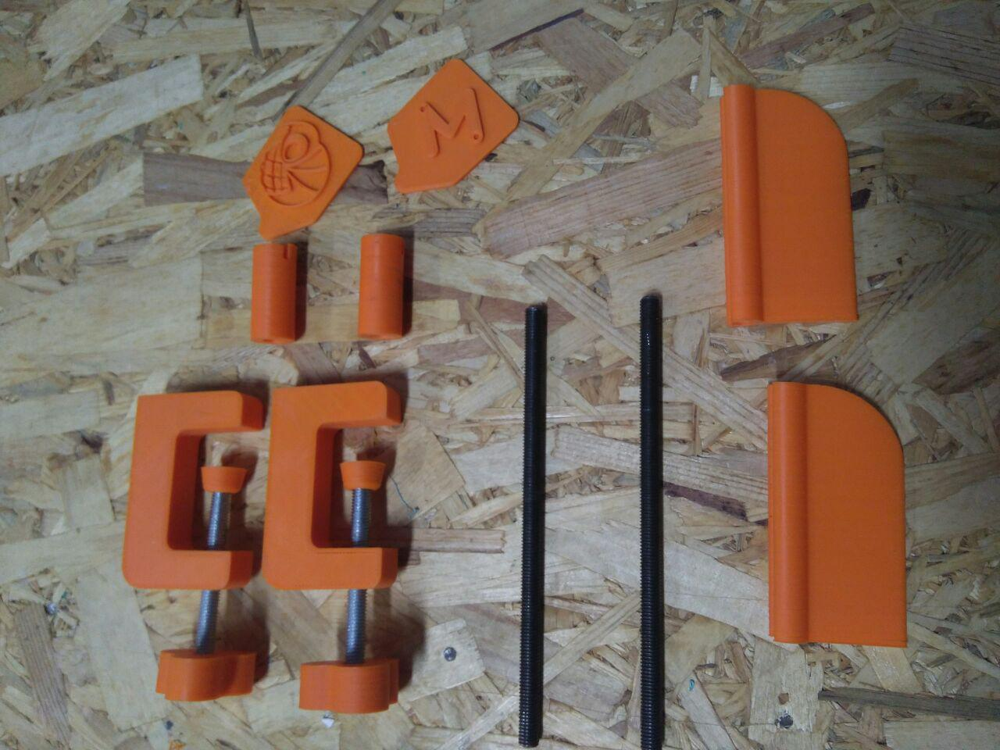
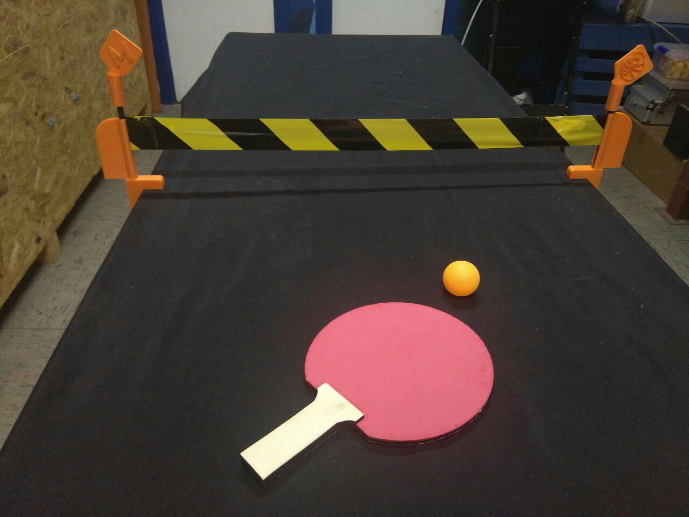
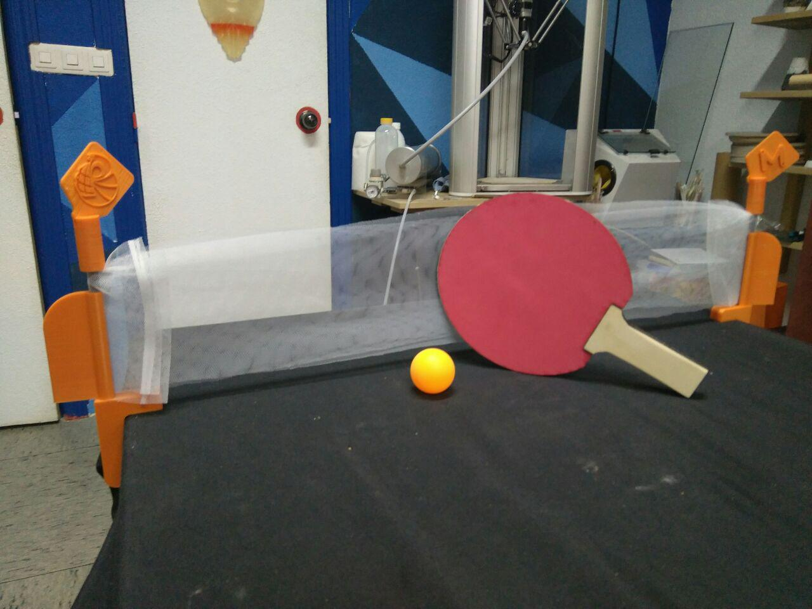

# DIY PING PONG SET

<table>
<tr>
<td>

</td>
</tr>
</table>

  

Simple pingpong set developed for Breakers class in Madrid

## BOM
- playwood sheet 5mm
- 3mm EVA foam sheet
- PLA filament
- 3D printer
- 2 M8x100 screw with hexagonal head
- 2 M8 lead screw 150mm
- 3D printed parts

## Files

###3D Printed Parts

**CAP**  

**CLAMP** 

**Flag Holder**  

**Flag** 

**Handwheel**

**M8**

**Net Holder** 

###2D

**dxf Pingpong**  

###MODIFICATION

Is possible to modify and customizing various parts:

**CAP**  
**Flag Holder**  
**Flag** 
**Handwheel**
**Net Holder** 

Use the **M8** stl file to boolean subtraction and modify as you want

**LASER PARTS**  Is possible to personalize the handle and the foam by engraving the parts

## Assembly

Video here: https://youtu.be/hFMEiLEDjKI

## Contributing
1. Fork it!
2. Create your feature branch: `git checkout -b my-new-feature`
3. Commit your changes: `git commit -am 'Add some feature'`
4. Push to the branch: `git push origin my-new-feature`
5. Submit a pull request :D

## Credits

Designed by Gianluca Pugliese [Owensource](https://www.owensource.com) 

## License

is licensed under a [Creative Commons Attribution-ShareAlike 4.0 International License](http://creativecommons.org/licenses/by-sa/4.0/). Please read the LICENSE files for more details.

